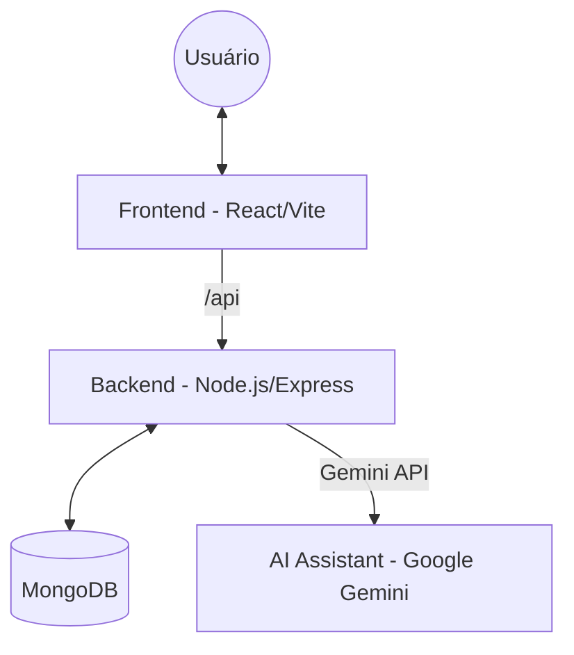

# Documentação de Infraestrutura - MakingMoney (GestãoPro)

Este documento detalha a arquitetura, componentes e processos de implantação do sistema MakingMoney.

## 🏗️ Arquitetura Geral

O sistema segue uma arquitetura de cliente-servidor moderna, composta por três camadas principais:

1.  **Frontend**: Single Page Application (SPA) React.
2.  **Backend**: API RESTful Node.js/Express.
3.  **Database**: Banco de dados orientado a documentos MongoDB.



---

## 💻 Componentes e Tecnologias

### 1. Frontend
- **Framework**: React 19 + TypeScript
- **Build Tool**: Vite
- **Estização**: Tailwind CSS
- **Chamadas API**: Axios + TanStack React Query
- **Gráficos**: Recharts
- **Servidor de Produção**: Nginx (via Docker)
- **Portas**: 
    - Desenvolvimento: `5173`
    - Produção (Docker): `80`

### 2. Backend
- **Runtime**: Node.js 20+
- **Framework**: Express.js
- **Linguagem**: TypeScript
- **Autenticação**: JSON Web Token (JWT) + bcryptjs
- **ORM/ODM**: Mongoose
- **Segurança**: Helmet, CORS, Express-rate-limit
- **Logs**: Winston + Morgan
- **Portas**: `3001`

### 3. Banco de Dados
- **Motor**: MongoDB 7.0
- **Porta**: `27017`

---

## 🛠️ Modos de Inicialização

### A. Desenvolvimento Local (Windows/Nativo)
São fornecidos scripts `.bat` para facilitar a inicialização rápida no Windows.

- `iniciar-tudo.bat`: Inicia o backend e o frontend em janelas separadas.
- `iniciar-backend.bat`: Inicia apenas o backend (`npm run dev`).
- `iniciar-frontend.bat`: Inicia apenas o frontend (`npm run dev`).

> [!IMPORTANT]
> Requer uma instância do MongoDB rodando localmente na porta `27017`.

### B. Containerização (Docker)
O projeto está totalmente configurado para rodar via Docker Compose.

- **Arquivo**: `docker-compose.yml`
- **Serviços**:
    - `mongodb`: Imagem oficial `mongo:7`.
    - `backend`: Build customizado a partir de `backend/Dockerfile`.
    - `frontend`: Build multi-stage (Build Node + Run Nginx) a partir de `frontend/Dockerfile`.

**Comando para subir a stack:**
```bash
docker-compose up --build
```

---

## 🌐 Configuração de Rede e Proxy

Em ambiente de produção (Docker), o **Nginx** atua como servidor web e proxy reverso.

- Requisições para `/` são servidas como arquivos estáticos (SPA).
- Requisições para `/api` são redirecionadas internamente para o serviço `backend:3001`.

**Configurações Nginx (`frontend/nginx.conf`):**
- Gzip ativado para melhor performance.
- Cache de assets estáticos (`/assets`).
- Fallback para `index.html` para suporte a rotas do React Router.

---

## 🔐 Variáveis de Ambiente (.env)

### Backend (`backend/.env`)
| Variável | Descrição | Exemplo |
| :--- | :--- | :--- |
| `MONGODB_URI` | URI de conexão com o MongoDB | `mongodb://localhost:27017/MMdb` |
| `JWT_SECRET` | Chave secreta para assinatura de tokens | `chave-secreta-2026` |
| `JWT_EXPIRES_IN` | Tempo de expiração do token | `7d` |
| `GEMINI_API_KEY` | Chave da API do Google Gemini | `sua-chave-aqui` |
| `PORT` | Porta de execução do backend | `3001` |
| `FRONTEND_URL` | URL de origem do frontend (CORS) | `http://localhost:80` |

---

## 📦 Estrutura de Diretórios (Infra)

```text
MakingMoney/
├── backend/
│   ├── Dockerfile          # Imagem de produção backend
│   ├── .env                # Configurações sensíveis
│   └── package.json        # Dependências de runtime/dev
├── frontend/
│   ├── Dockerfile          # Imagem multi-stage (Build & Nginx)
│   ├── nginx.conf          # Configuração do Proxy Reverso
│   └── package.json        # Dependências do app e Vite
└── docker-compose.yml      # Orquestração de todos os serviços
```

---

## 📈 Verificação de Saúde (Health)

- **MongoDB**: O Docker Compose realiza um `healthcheck` usando `mongosh --eval "db.adminCommand('ping')"` antes de subir o backend.
- **Backend**: Depende do MongoDB estar "healthy".
- **Frontend**: Depende do Backend estar operacional.
